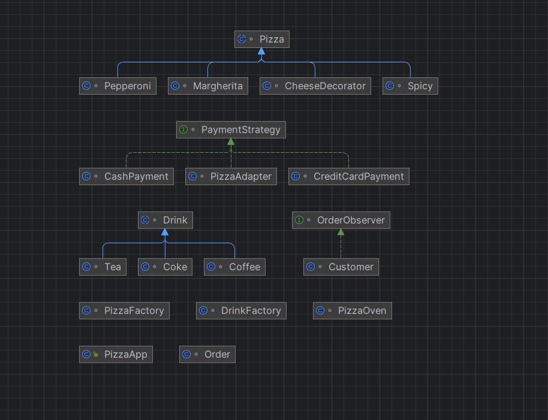

# PizzaFinalSDP README

## Group: SE-2215
### Team members: Ansar Bashaev, Duman Dudarbek, Baubek Zhumabayev

## Project Overview
Welcome to PizzaFinalSDP! This project is designed to streamline the pizza ordering process, providing a user-friendly platform for customers while enabling efficient order management for restaurant staff.

### Idea of the Project
The primary goal is to create an efficient and user-centric system for ordering pizzas through a web-based interface. Customers can browse pizzas, customize orders, and place them, while staff can manage orders and inventory.

### Purpose of the Work
To simplify the pizza ordering process for customers and staff, enhancing the ordering experience and operational efficiency.

### Objectives of the Work
- Develop a user-friendly web interface for ordering pizzas.
- Implement an administrative dashboard for managing orders and inventory.
- Ensure smooth information flow between customers and staff.
- Enhance order processing and delivery tracking efficiency.

## Main Body

### Features and Design Patterns
- **Observer Pattern:** Notify users about order status changes in real-time.
- **Factory Method:** Create different pizza types based on user selections dynamically.
- **Singleton Pattern:** Manage user sessions for consistency and security.
- **Adapter Pattern:** Integrate various payment gateways seamlessly.
- **Decorator Pattern:** Customize pizza orders dynamically with extra toppings, cheese, or crust options.
- **Strategy Pattern:** Implement various delivery strategies based on user preferences.

### UML Diagram

## Conclusion

### Key Points
- Implemented Observer and Factory Method for order management and dynamic pizza creation.
- Real-time notifications enhanced user experience.
- Improved order processing for staff.

### Project Outcomes and Challenges
Successfully created a user-centric pizza ordering system. Challenges included implementing multiple design patterns simultaneously and establishing class connections.

### Future Improvements
- Implement additional design patterns.
- Enhance the user interface for better engagement.
- Introduce analytics for order trends and preferences.
